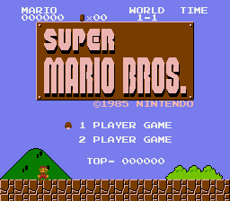
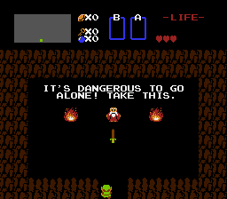
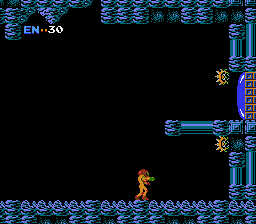

# RustyNES

## Summary

<p align="center">
  
</p>

> photo credit for background: [Zsolt Palatinus](https://unsplash.com/@sunitalap) on [unsplash](https://unsplash.com/photos/pEK3AbP8wa4)

`RustyNES` is an emulator for the Nintendo Entertainment System (NES) released in 1985, written
using [Rust][rust] and [SDL2][sdl2].

It started as a personal curiosity that turned into a project for two classes to demonstrate
a proficiency in Rust and in digital sound production. It is still a work-in-progress, but I hope to
transform it into a fully-featured NES emulator that can play most games. It is my hope to see
a Rust emulator rise in popularity and compete with the more popular C and C++ versions.

`RustyNES` is also meant to showcase how clean and readable low-level Rust programs can be in addition
to them having the type and memory-safety guarantees that Rust is known for.

## Screenshots

&nbsp;&nbsp;
&nbsp;&nbsp;

## Mappers

Support for the following mappers is currently implemented or in development:

| #   | Name                   | Example Games                             | # of Games<sup>1</sup>  | % of Games<sup>1</sup> |
| --- | ---------------------- | ----------------------------------------- | ----------------------- | ---------------------- |
| 000 | NROM                   | Bomberman, Donkey Kong, Super Mario Bros. |  ~247                   |                 10.14% |
| 001 | SxROM/MMC1             | Metroid, Legend of Zelda, Tetris          |  ~680                   |                 27.91% |
| 002 | UxROM                  | Castlevania, Contra, Mega Man             |  ~269                   |                 11.04% |
| 003 | CNROM                  | Arkanoid, Paperboy, Pipe Dream            |  ~155                   |                  6.36% |
| 004 | TxROM/MMC3             | Kirby's Adventure, Super Mario Bros. 2/3  |  ~599                   |                 24.59% |
| 005 | ExROM/MMC5<sup>2</sup> | Castlevania 3, Laser Invasion             |   ~24                   |                  0.99% |
| 007 | AxROM                  | Battletoads, Marble Madness               |   ~75                   |                  3.08% |
| 009 | PxROM/MMC2             | Punch Out!!                               |     1                   |              &lt;0.01% |
|     |                        |                                           | ~2050                   |                 84.11% |

1. [Source](http://bootgod.dyndns.org:7777/stats.php?page=6)
2. ExROM is still in development

## Dependencies

* [Rust][rust]
* [SDL2][sdl2]

## Installation

This should run on most platforms that supports Rust and SDL2, howeer, it's only being developed and
tested on macOS High Sierra at this time. So far, I've tested on macOS High Sierra, Mojave, Windows
7, Windows 10, Fedora Linux, and Raspberry Pi 4 (though performance is less than desired). When
1.0.0 is released, I'll make binaries available for all major platforms. Until then, follow the
below instructions to build for your platform.

* Install [Rust][rust] (follow the link)
* Install [SDL2](https://github.com/Rust-SDL2/rust-sdl2) development libraries (follow the link)
  * Linux and macOS should be straightforward
  * Windows makes this a bit more complicated. Be sure to follow the above link instructions
    carefully. For the simple case of using `rustup`, all of the files in `lib\` from the Visual C++
    32/64-bit development zip should go in your `C:\Users\{Your Username}\.rustup\toolchains\
    {current toolchain}\lib\rustlib\{current toolchain}\lib` directory (where the
    `{current toolchain}` will likely have `x86_64-pc-windows` in its name) and then a copy of
    `lib\SDl2.dll` needs to go in your `%USERPROFILE%\.cargo\bin` directory next to the
    `rustynes.exe` binary.
* Download & install `RustyNES`. Stable releases can be found on the `Releases` tab at the top of
the page. To build directly from a release tag, follow these steps:

        $ git clone https://github.com/lukexor/rustynes.git
        $ cd rustynes/
        $ git checkout v0.5.0
        $ cargo install --path ./

This will install the `v0.5.0` tagged release of the `RustyNES` binary to your `cargo` bin directory
located at either `$HOME/.cargo/bin/` on a Unix-like platform or `%USERPROFILE%\.cargo\bin` on
Windows. Replace the release tag with the one you want to install. The latest is recommended. You
can see which release tags are available by clicking the `Releases` tab at the top of this page or
by running the following command from the checked out git repository:

        $ git tag -l

## Usage

For each platform, the first command may not be needed depending on the contents of your `$PATH`
environment variable.

### Windows

        $ cd %USERPROFILE%\.cargo\bin
        $ rustynes.exe {Path to your game}

### macOS/Linux

        $ cd $HOME/.cargo/bin/
        $ rustynes {Path to your game}

### Additional Options

```
rustynes [FLAGS] [OPTIONS] [path]

FLAGS:
        --concurrent_dpad    Enables the ability to simulate concurrent L+R and U+D on the D-Pad
    -d, --debug              Debug
    -f, --fullscreen         Fullscreen
    -h, --help               Prints help information
    -l, --log_cpu            Print CPU instructions to STDOUT
        --no_save            Don't load or save game state.
        --ppu_debug          Start with PPU debugger enabled. Displays nametables, patterns, and palettes.
        --randomize_ram      By default RAM initializes to 0x00 on power up. This affects some games RNG seed
                             generators.
        --sound_off          Disable Sound
    -V, --version            Prints version information

OPTIONS:
        --save_slot <save-slot>    Use Save Slot # (Options: 1-4) [default: 1]
    -s, --scale <scale>            Window scale [default: 3]

ARGS:
    <path>    The NES ROM to load or a directory containing `.nes` ROM files. [default: current directory]
```

## Controls

| Button                | Keyboard    | Controller       |
| --------------------- | ----------- | ---------------- |
| A                     | Z           | A                |
| B                     | X           | B                |
| A (Turbo)             | A           | X                |
| B (Turbo)             | S           | Y                |
| Start                 | Enter       | Start            |
| Select                | Right Shift | Select           |
| Up, Down, Left, Right | Arrow Keys  | Left Stick/D-Pad |

There are also some emulator actions:

| Action                            | Keyboard         | Controller         |
| --------------------------------- | ---------------- | ------------------ |
| Open/Run ROM<sup>*</sup>          | Ctrl-O           |                    |
| Pause / Open Menu                 | Escape           | Right Stick Button |
| Quit                              | Ctrl-Q           |                    |
| Reset                             | Ctrl-R           |                    |
| Power Cycle                       | Ctrl-P           |                    |
| Increase Speed 25%                | Ctrl-=           | Right Trigger      |
| Decrease Speed 25%                | Ctrl--           | Left Trigger       |
| Toggle Fast-Forward               | Space            |                    |
| Set State Slot                    | Ctrl-(1-4)       |                    |
| Save State                        | Ctrl-S           | Left Shoulder      |
| Load State                        | Ctrl-L           | Right Shoulder     |
| Toggle Music/Sound                | Ctrl-M           |                    |
| Toggle Recording<sup>*</sup>      | Ctrl-V           |                    |
| Toggle Debugger                   | Ctrl-D           |                    |
| Toggle Fullscreen                 | Ctrl-Enter       |                    |
| Take Screenshot                   | F10              |                    |
| Cycle Log Level<sup>*</sup>       | F9               |                    |

### Note on Controls

Not all controls are implemented yet. Those that aren't are marked with an <sup>*</sup>.

Ctrl-(1-4) may have conflicts in macOS with switching Desktops 1-4. You can disable this in the
keyboard settings. I may consider changing them to something else or making macOS use the Option key
in place of Ctrl, but I'm not bothering with OS-specific bindings just yet.

## Building/Testing

To build the project run `cargo build` or `cargo build --release` (if you want playable framerates).

Unit and integration tests can be run with `cargo test`. There are also several test roms that can
be run to test various capabilities of the emulator. They are all located in the `tests/` directory.

Run them the same way you would run a game. e.g.

```
cargo run --release tests/cpu/nestest.nes
```

## Known Issues

See the github issue tracker.

## Roadmap

The following is a checklist of features and their progress:
- [x] Console
  - [x] NTSC
  - [ ] PAL
  - [ ] Dendy
  - [ ] Headless mode
- [x] Central Processing Unit (CPU)
  - [x] Official Instructions
  - [x] Unofficial Instructions (Not fully tested)
  - [x] Interrupts
- [x] Picture Processing Unit (PPU)
  - [x] VRAM
  - [x] Background
  - [x] Sprites
  - [ ] TV Raster Effects
  - [ ] Emphasize RGB/Grayscale
- [x] Audio Processing Unit (APU)
  - [x] Delta Mulation Channel (DMC)
- [x] Inputs
  - [x] Keyboard
  - [x] Standard Controller
  - [x] Turbo support
- [x] Memory
- [x] Cartridge
  - [x] Battery-backed Save RAM
  - [x] iNES Format
  - [x] NES 2.0 Format (Can read headers, but many features still unsupported)
  - [x] Mappers
    - [x] NROM (Mapper 0)
    - [x] SxROM/MMC1 (Mapper 1)
    - [x] UxROM (Mapper 2)
    - [x] CNROM (Mapper 3)
    - [x] TxROM/MMC3 (Mapper 4)
    - [ ] ExROM/MMC5 (Mapper 5)
    - [x] AxROM (Mapper 7)
    - [x] PxROM/MMC2 (Mapper 9)
- [x] User Interface (UI)
  - [x] SDL2
  - [ ] WebAssembly
  - [x] Window
  - [ ] Menu
    - [ ] Open/Run ROM with file browser
    - [ ] Configuration options
  - [x] Pause
  - [x] Toggle Fullscreen
  - [x] Reset
  - [x] Power Cycle
  - [x] Increase/Decrease Speed/Fast-forward
  - [x] Save/Load State
  - [x] Take Screenshots
  - [ ] Toggle Recording
  - [x] Toggle Sound
  - [x] Toggle Debugger
  - [ ] Custom Keybinds
  - [ ] Game Genie
  - [ ] WideNES
- [x] Testing/Debugging/Documentation
  - [x] Breakpoint CPU debugger (missing some features)
  - [x] PPU Debug mode (displays palettes, nametables, and sprite patterns)
  - [x] Unit/Integration tests (run with cargo test)
    - [x] CPU integration testing (with [nestest](http://www.qmtpro.com/~nes/misc/nestest.txt))
    - [ ] Other tests (Missing a lot here)
  - [x] Test ROMs (most pass, many still do not)
      - [ ] Automated rom tests
  - [ ] Rust Docs (work in progress)
  - [ ] Debug/Trace logging

## Documentation

In addition to the wealth of information in the `docs` directory, I also referenced these websites
extensively during development:

* [NES Documentation (PDF)](http://nesdev.com/NESDoc.pdf)
* [NES Dev Wiki](http://wiki.nesdev.com/w/index.php/Nesdev_Wiki)

## License

`RustyNES` is licensed under the GPLv3 license. See the `LICENSE.md` file in the root for a copy.

## Contact

For issue reporting, please use the github issue tracker. You can contact me directly
[here](https://lukeworks.tech/contact/).

## Contributing

While this is primarily a personal project, I welcome any contributions or suggestions. Feel free to
submit a pull request if you want to help out!

## Credits

Implementation was inspiried by several amazing NES projects, without which I would not have been
able to understand or digest all the information on the NES wiki.

- https://github.com/fogleman/nes
- https://github.com/pcwalton/sprocketnes
- https://github.com/MichaelBurge/nes-emulator
- https://github.com/AndreaOrru/LaiNES
- https://github.com/daniel5151/ANESE

[rust]: https://www.rust-lang.org/tools/install
[sdl2]: https://www.libsdl.org/
