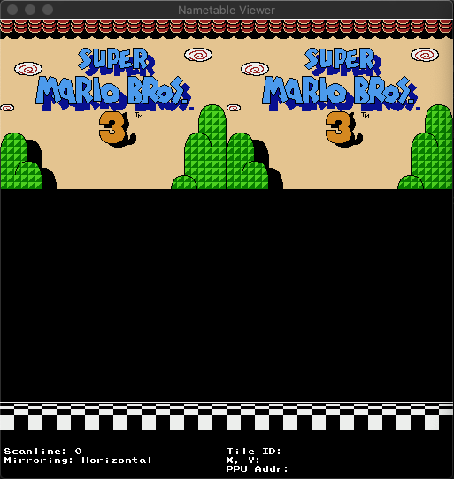
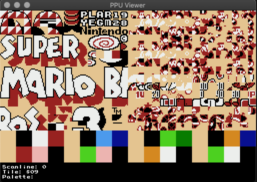
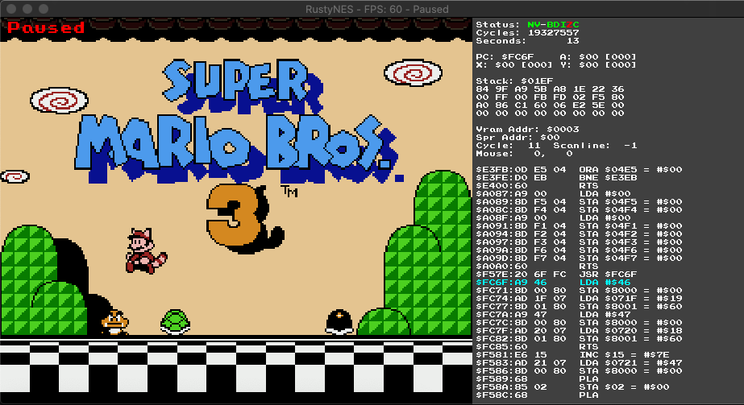

# RustyNES

## Summary

<p align="center">
  
</p>

> photo credit for background: [Zsolt Palatinus](https://unsplash.com/@sunitalap) on [unsplash](https://unsplash.com/photos/pEK3AbP8wa4)

`RustyNES` is an emulator for the Nintendo Entertainment System (NES) released in 1985, written
using [Rust][rust] and [SDL2][sdl2].

It started as a personal curiosity that turned into a project for two classes to demonstrate
a proficiency in Rust and in digital sound production. It is still a work-in-progress, but I hope to
transform it into a fully-featured NES emulator that can play most games. It is my hope to see
a Rust emulator rise in popularity and compete with the more popular C and C++ versions.

`RustyNES` is also meant to showcase how clean and readable low-level Rust programs can be in addition
to them having the type and memory-safety guarantees that Rust is known for.

## Screenshots

&nbsp;&nbsp;
&nbsp;&nbsp;

## Mappers

Support for the following mappers is currently implemented or in development:

| #   | Name                   | Example Games                             | # of Games<sup>1</sup>  | % of Games<sup>1</sup> |
| --- | ---------------------- | ----------------------------------------- | ----------------------- | ---------------------- |
| 000 | NROM                   | Bomberman, Donkey Kong, Super Mario Bros. |  ~247                   |                 10.14% |
| 001 | SxROM/MMC1             | Metroid, Legend of Zelda, Tetris          |  ~680                   |                 27.91% |
| 002 | UxROM                  | Castlevania, Contra, Mega Man             |  ~269                   |                 11.04% |
| 003 | CNROM                  | Arkanoid, Paperboy, Pipe Dream            |  ~155                   |                  6.36% |
| 004 | TxROM/MMC3             | Kirby's Adventure, Super Mario Bros. 2/3  |  ~599                   |                 24.59% |
| 005 | ExROM/MMC5             | Castlevania 3, Laser Invasion             |   ~24                   |                  0.99% |
| 007 | AxROM                  | Battletoads, Marble Madness               |   ~75                   |                  3.08% |
| 009 | PxROM/MMC2             | Punch Out!!                               |     1                   |              &lt;0.01% |
|     |                        |                                           | ~2050                   |                 84.11% |

1. [Source](http://bootgod.dyndns.org:7777/stats.php?page=6)

## Dependencies

* [Rust][rust]
* [SDL2][sdl2]

## Installation

This should run on most platforms that supports Rust and SDL2, howeer, it's only being developed and
tested on macOS High Sierra at this time. So far, I've tested on macOS High Sierra, Mojave, Windows
7, Windows 10, Fedora Linux, and Raspberry Pi 4 (though performance is less than desired). When
1.0.0 is released, I'll make binaries available for all major platforms. Until then, follow the
below instructions to build for your platform.

* Install [Rust][rust] (follow the link)
  * If Rust is already installed. Ensure it's up-to-date by running:

        $ rustup update

* Install [SDL2](https://github.com/Rust-SDL2/rust-sdl2) development libraries (follow the link)
  * Linux and macOS should be straightforward
  * Windows makes this a bit more complicated. Be sure to follow the above link instructions
    carefully. For the simple case of using `rustup`, all of the files in `lib\` from the Visual C++
    32/64-bit development zip should go in your `C:\Users\{Your Username}\.rustup\toolchains\
    {current toolchain}\lib\rustlib\{current toolchain}\lib` directory (where the
    `{current toolchain}` will likely have `x86_64-pc-windows` in its name) and then a copy of
    `lib\SDl2.dll` needs to go in your `%USERPROFILE%\.cargo\bin` directory next to the
    `rustynes.exe` binary.
* Download & install `RustyNES`. Stable releases can be found on the `Releases` tab at the top of
the page. To build directly from a release tag, follow these steps:

        $ git clone https://github.com/lukexor/rustynes.git
        $ cd rustynes/
        $ git checkout v0.5.0
        $ cargo install --path ./

This will install the `v0.5.0` tagged release of the `RustyNES` binary to your `cargo` bin directory
located at either `$HOME/.cargo/bin/` on a Unix-like platform or `%USERPROFILE%\.cargo\bin` on
Windows. Replace the release tag with the one you want to install. The latest is recommended. You
can see which release tags are available by clicking the `Releases` tab at the top of this page or
by running the following command from the checked out git repository:

        $ git tag -l

## Usage

For each platform, the first command may not be needed depending on the contents of your `$PATH`
environment variable.

### Windows

        $ cd %USERPROFILE%\.cargo\bin
        $ rustynes.exe {Path to your game}

### macOS/Linux

        $ cd $HOME/.cargo/bin/
        $ rustynes {Path to your game}

### Additional Options

```
USAGE:
    rustynes [FLAGS] [OPTIONS] [--] [path]

FLAGS:
        --clear-savestate    Removes existing savestates for current save-slot
        --concurrent-dpad    Enables the ability to simulate concurrent L+R and U+D on the D-Pad.
    -d, --debug              Start with the CPU debugger enabled and emulation paused at first CPU instruction.
    -f, --fullscreen         Start fullscreen.
    -h, --help               Prints help information
        --record-replay      Record gameplay to a file for later action replay.
        --rewind             Enable savestate rewinding
        --savestates-off     Disable savestates
        --sound-off          Disable sound.
        --unlock-fps         Disables locking FPS to 60. Also disables sound.
    -V, --version            Prints version information
    -v, --vsync-off          Disable vsync.

OPTIONS:
        --genie-codes <genie-codes>...    List of Game Genie Codes (space separated).
    -l, --log-level <log-level>           Set logging level. [default: error]  [possible values: off, error, warn, info,
                                          debug, trace]
        --replay <replay>                 Replay a saved action replay file.
        --savestate-slot <save-slot>      Set savestate slot #. [default: 1]  [possible values: 1, 2, 3, 4]
    -s, --scale <scale>                   Window scale [default: 3]
        --speed <speed>                   Increase/Decrease emulation speed. [default: 1.0]

ARGS:
    <path>    The NES ROM to load or a directory containing `.nes` ROM files. [default: current directory]

```

## Controls

| Button                | Keyboard    | Controller       |
| --------------------- | ----------- | ---------------- |
| A                     | Z           | A                |
| B                     | X           | B                |
| A (Turbo)             | A           | X                |
| B (Turbo)             | S           | Y                |
| Start                 | Enter       | Start            |
| Select                | Right Shift | Back             |
| Up, Down, Left, Right | Arrow Keys  | Left Stick/D-Pad |

There are also some emulator actions:

| Action                            | Keyboard         | Controller         |
| --------------------------------- | ---------------- | ------------------ |
| Pause                             | Escape           | Guide Button       |
| Configuration Menu                | Ctrl-C           |                    |
| Open ROM<sup>\*</sup>              | Ctrl-O           |                    |
| Quit                              | Ctrl-Q           |                    |
| Reset                             | Ctrl-R           |                    |
| Power Cycle                       | Ctrl-P           |                    |
| Increase Speed 25%                | Ctrl-=           | Right Shoulder     |
| Decrease Speed 25%                | Ctrl--           | Left Shoulder      |
| Fast-Forward 2x (while held)      | Space            |                    |
| Set Save State Slot #             | Ctrl-(1-4)       |                    |
| Save State                        | Ctrl-S           |                    |
| Load State                        | Ctrl-L           |                    |
| Rewind 5 Seconds (when enabled)   | Comma            |                    |
| Stop Action Replay Recording      | Shift-V          |                    |
| Toggle Music/Sound                | Ctrl-M           |                    |
| Toggle CPU Debugger               | Ctrl-D           |                    |
| Toggle Fullscreen                 | Ctrl-Return      |                    |
| Toggle Vsync                      | Ctrl-V           |                    |
| Toggle NTSC Filter                | Ctrl-N           |                    |
| Toggle PPU Viewer                 | Shift-P          |                    |
| Toggle Nametable Viewer           | Shift-N          |                    |
| Take Screenshot                   | F10              |                    |
| Increase Logging Level            | F9               |                    |

While the CPU Debugger is open (these can also be held down):

| Action                            | Keyboard         |
| --------------------------------- | ---------------- |
| Step a single CPU instruction     | C                |
| Step over a CPU instruction       | O                |
| Step out of a CPU instruction     | Ctrl-O           |
| Step a single scanline            | S                |
| Step an entire frame              | F                |
| Toggle Live CPU Debug Updating    | D                |

<sup>&ast;</sup>: Not yet Implemented

### Note on Controls

Ctrl-(1-4) may have conflicts in macOS with switching Desktops 1-4. You can disable this in the
keyboard settings. I may consider changing them to something else or making macOS use the Option key
in place of Ctrl, but I'm not bothering with OS-specific bindings just yet.

## Directories & Screenshots

Battery-backed game data and save states are stored in `$HOME/.rustynes`. Screenshots are saved
to the directory where `RustyNES` was launched from. This may change in a future release.

## Powerup State

The original NES hardware had semi-random contents located in RAM upon powerup and several games
made use of this to seed their Random Number Generators (RNGs). By default, the binaries and build
steps for `RustyNES` emulate randomized powerup RAM state. This shows up in several games such as
Final Fantasy, River City Ransom, and Impossible Mission II, amongst others. Not emulating this
would make these games seem deterministic when they weren't intended to be.

If you would like `RustyNES` to provide fully deterministic emulated powerup state, you'll need to
build the binary from source using the following command:

        $ cargo build --release --features no-randomize-ram

## Building/Testing

To build the project, ensure the dependencies are installed as outlined in the `Installation`
section and then run `cargo build` or `cargo build --release` (if you want better framerates).

Unit and integration tests can be run with `cargo test`. There are also several test roms that can
be run to test various capabilities of the emulator. They are all located in the `tests/` directory.

Run them the same way you would run a game. e.g.

```
cargo run --release tests/cpu/nestest.nes
```

## Debugging

There are built-in debugging tools that allow you to monitor game state and step through CPU
instructions manually. See the `Controls` section for more on keybindings.

The Default debugger screen provides CPU information such as the statis of the CPU register flags,
Program Counter, Stack, PPU information, and the previous/upcoming CPU instructions.

The Nametable Viewer displays the current Nametables in PPU memory and allows you to scroll up/down
to change the scanline at which the nametable is read. Some games swap out nametables mid-frame.

The PPU Viewer shows the current sprite and palettes loaded. You can also scroll up/down in a
similar manner to the Nametable Viewer. Super Mario Bros 3 for example swaps out sprites mid-frame
to render animations.

&nbsp;&nbsp;


## Troubleshooting

If you get some sort of nasty error when trying to start a game, try passing the --no_save option to
ensure it's not an incompatible save file causing the issue. When 1.0 releases, I'll be much more
careful about backwards breaking changes with regards to save files, but for now it's highly
volatile and due to the nature of how I serialize data, I can only catch certain sorts of data
inconsistencies.

If the issue is not save related, please submit an issue in the github issue tracker. A good
guideline for what to include is:

- The game experiencing the issue (e.g. Super Mario Bros 3)
- Operating system and version (e.g. Windows 7)
- What you were doing when the error happened
- The entire error message

When the browser version is available, also include:
- Web browser and version (e.g. Chrome 77.0.3865)

## Known Issues

See the github issue tracker.

## Roadmap

The following is a checklist of features and their progress:
- [x] Console
  - [x] NTSC
  - [ ] PAL
  - [ ] Dendy
  - [ ] Headless mode
- [x] Central Processing Unit (CPU)
  - [x] Official Instructions
  - [x] Unofficial Instructions (Some still incorrect)
  - [x] Interrupts
- [x] Picture Processing Unit (PPU)
  - [x] VRAM
  - [x] Background
  - [x] Sprites
  - [x] TV Raster Effects (Not perfect, but neat anyways)
  - [x] Emphasize RGB/Grayscale
- [x] Audio Processing Unit (APU)
  - [x] Delta Mulation Channel (DMC)
- [x] Inputs
  - [x] Keyboard
  - [x] Standard Controller
  - [x] Turbo
  - [ ] Light Gun (Initial implementation will be mouse based)
- [x] Memory
- [x] Cartridge
  - [x] Battery-backed Save RAM
  - [x] iNES Format
  - [x] NES 2.0 Format (Can read headers, but many features still unsupported)
  - [x] Mappers
    - [x] NROM (Mapper 0)
    - [x] SxROM/MMC1 (Mapper 1)
    - [x] UxROM (Mapper 2)
    - [x] CNROM (Mapper 3)
    - [x] TxROM/MMC3 (Mapper 4)
    - [x] ExROM/MMC5 (Mapper 5) (Mostly done, but some games don't work)
    - [x] AxROM (Mapper 7)
    - [x] PxROM/MMC2 (Mapper 9)
- [x] User Interface (UI)
  - [x] PixEngine (Custom graphics library for handling video and audio)
  - [x] UI Notification messages
  - [x] SDL2
  - [ ] WebAssembly (in progress!)
  - [x] Window
  - [x] Menu (Right now it's just an empty menu)
    - [ ] Open/Run ROM with file browser
    - [ ] Configuration options
  - [x] Pause
  - [x] Toggle Fullscreen
  - [x] Reset
  - [x] Power Cycle
  - [x] Increase/Decrease Speed/Fast-forward
  - [x] Rewind 5 seconds (5 total rewinds)
  - [x] Save/Load State
  - [x] Take Screenshots
  - [x] Toggle Action Recording
  - [ ] Sound Recording (Save those memorable tunes!)
  - [x] Toggle Sound
  - [x] Toggle Debugger
  - [ ] Custom Keybinds
  - [x] Game Genie
  - [ ] [WideNES](https://prilik.com/ANESE/wideNES)
- [ ] Misc
  - [ ] Network Multi-player
- [x] Testing/Debugging/Documentation
  - [x] CPU Debugger (Displays CPU status, registers, and disassembly)
    - [X] Step Into/Out/Over
    - [ ] Breakpoints
  - [ ] Memory Hex Debugger
  - [x] PPU Viewer (Displays PPU sprite patterns and color palettes)
  - [x] Nametable Viewer (Displays all four PPU backgrounds)
    - [X] Scanline Hit Configuration (For debugging IRQ Nametable changes)
    - [ ] Scroll lines (Automatically adjusts the scanline, showing live nametable changes)
  - [x] Unit/Integration tests (run with cargo test)
    - [x] CPU integration testing (with [nestest](http://www.qmtpro.com/~nes/misc/nestest.txt))
    - [ ] Other tests (Missing a lot here)
  - [x] Test ROMs (most pass, many still do not)
      - [ ] Automated rom tests (in progress now that action recording is finished)
  - [ ] Rust Docs
  - [ ] Logging
      - [x] Console
      - [ ] File

## Documentation

In addition to the wealth of information in the `docs/` directory, I also referenced these websites
extensively during development:

* [NES Documentation (PDF)](http://nesdev.com/NESDoc.pdf)
* [NES Dev Wiki](http://wiki.nesdev.com/w/index.php/Nesdev_Wiki)
* [6502 Datasheet](http://archive.6502.org/datasheets/rockwell_r650x_r651x.pdf)

## License

`RustyNES` is licensed under the GPLv3 license. See the `LICENSE.md` file in the root for a copy.

## Contact

For issue reporting, please use the github issue tracker. You can contact me directly
[here](https://lukeworks.tech/contact/).

## Contributing

While this is primarily a personal project, I welcome any contributions or suggestions. Feel free to
submit a pull request if you want to help out!

## Credits

Implementation was inspiried by several amazing NES projects, without which I would not have been
able to understand or digest all the information on the NES wiki.

- [fogleman NES](https://github.com/fogleman/nes)
- [sprocketnes](https://github.com/pcwalton/sprocketnes)
- [nes-emulator](https://github.com/MichaelBurge/nes-emulator)
- [LaiNES](https://github.com/AndreaOrru/LaiNES)
- [ANESE](https://github.com/daniel5151/ANESE)
- [FCEUX](http://www.fceux.com/web/home.html)

Also, a huge shout out to [OneLoneCoder](https://github.com/OneLoneCoder/) for his
[NES](https://github.com/OneLoneCoder/olcNES) and
[PixelGameEngine](https://github.com/OneLoneCoder/olcPixelGameEngine) series as those helped a ton
in some recent refactorings.

[rust]: https://www.rust-lang.org/tools/install
[sdl2]: https://www.libsdl.org/
